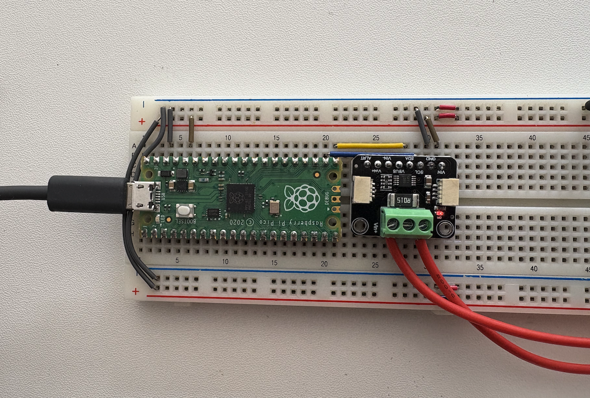
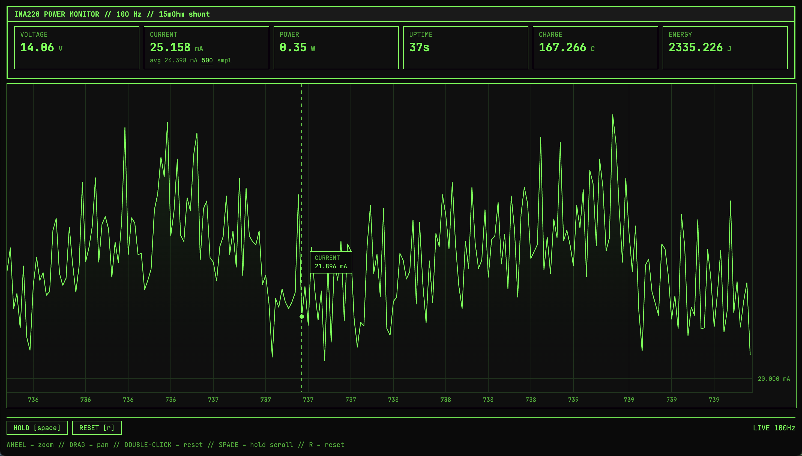

# Zing — INA current monitor suite

Poor man's [Joulescope](https://www.joulescope.com). Def some bugs here but works good enough. Buy a Joulescope if you want it good.

RP2040 + INA228 over I2C, streams JSON at 100 Hz

Don't forget to share your ground ❤️





| INA228 | Pico  |
|--------|-------|
| VS     | 3V3   |
| GND    | GND   |
| SDA    | GP16  |
| SCL    | GP17  |
| IN+    | before shunt |
| IN-    | after shunt  |

Shunt: 15mΩ between IN+ and IN-.

## Build & Flash

```bash
./build.sh   # → firmware/out/current_monitor.uf2
./flash.sh   # picotool or BOOTSEL drag
```

## Host tools

```bash
# CSV logger
python logger.py

# Web dashboard (http://localhost:8080)
python web/webdash.py
```

## Prerequisites

- [pico-sdk](https://github.com/raspberrypi/pico-sdk)
- ARM GCC toolchain
- CMake 3.31 (pico-sdk is currently incompatible with CMake 4.x)
- pyserial

## References

- [TradingView Lightweight Charts](https://github.com/tradingview/lightweight-charts)
- [Adafruit CircuitPython INA228](https://github.com/adafruit/Adafruit_CircuitPython_INA228)
- [Adafruit INA228 breakoutboard](https://www.adafruit.com/product/5832)
- [TI INA228 Datasheet](https://www.ti.com/lit/ds/symlink/ina228.pdf)
